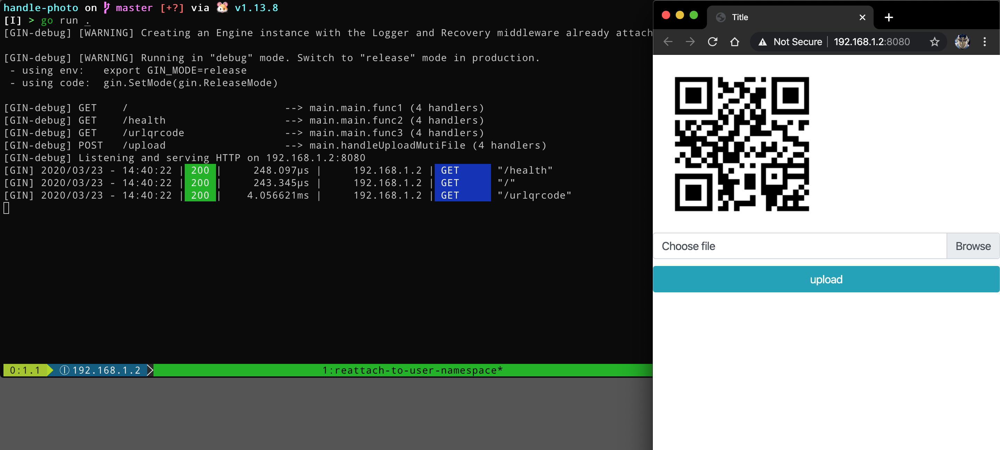
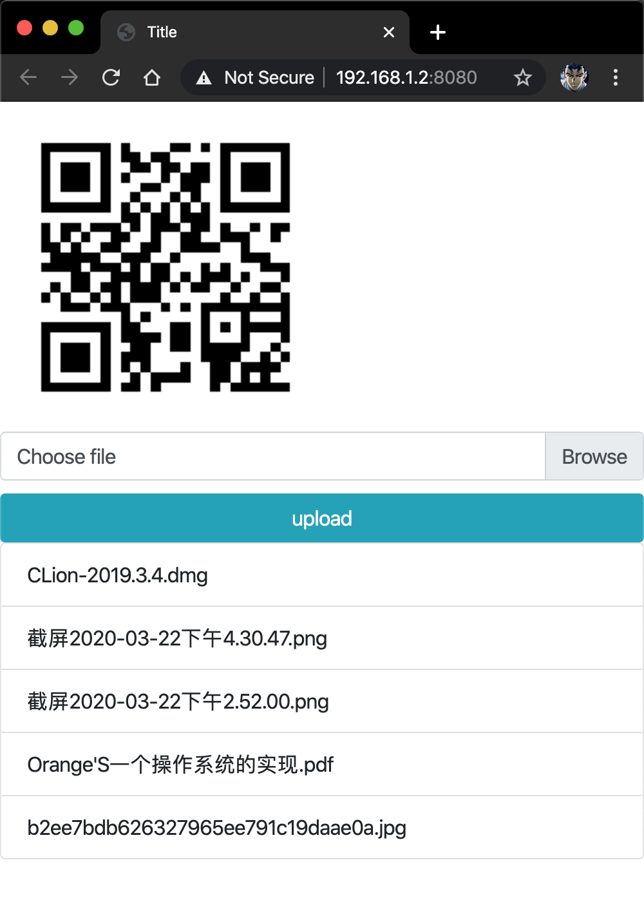
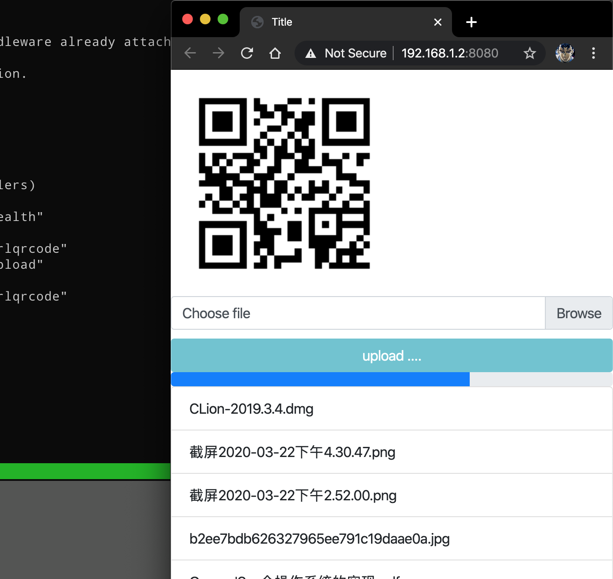
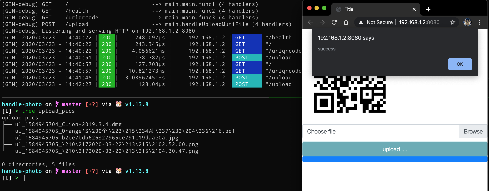

# 局域网上传文件

最近老爸换了台笔记本电脑，希望可以从手机向电脑传照片，新笔记本电脑的蓝牙和手机蓝牙老是连不上，试了别的一些手机照片管理软件，但是在电脑上都安装不起来，都是缺少某些 dll 文件，同时老爸觉得手机和电脑进行有线连接太麻烦的。于是乎我就有了一个想法，在笔记本电脑上运行个服务端提供上传文件的功能不就行了吗，只要手机和电脑是在用一个 WiFi 局域网下就可以了，手机浏览器访问电脑上的服务端程序上传文件，非常简单的需求。

首先先选取编程语言，首先将解释型语言以及需要虚拟机运行的语言 pass，因为我希望服务端程序体积尽量地小，最好就是一个可执行二进制文件，同时做到部署时零配置，图形界面点击图标即运行；底层语言 pass，因为我想几个小时内就写出这个程序，而且我也需要能交叉编译，因为我的开发电脑是 MacOS，而老爸的笔记本电脑是 Windows7。我熟悉的编程语言就那么几种，这么排除下来就剩下 Golang了，版本为 1.13。

给别人的用的程序最重要的要求是操作方便，所以我为笔记本电脑上运行的服务端程序设计了几个特性：点击可执行文件后直接打开浏览器，用来显示当前链接的二维码，方便手机扫码；同时，上传文件时需要显示进度条，方便查看进度。

由于是在家里的局域网中自行使用，所以没有添加任何权限校验以及安全校验。

从开发到验收（其实就是部署到 Win7 笔记本电脑上后用老爸手机上传几个文件），总共用了三个小时不到。其中不可避免地出现部分由于复制粘贴重复的代码，不过都无伤大雅。

服务端使用到了 gin-contrib/gin 作为服务端框架，skip2/go-qrcode 用于生成二维码，前端用的是 BootStrap4 和 JQuery。总之，就是怎么开发快怎么来，下面介绍几个技术点。

## 自动打开浏览器

在网上找到的一个代码段，直接用就 OK

```go
func openbrowser(url string) {
    var err error

    switch runtime.GOOS {
    case "linux":
        err = exec.Command("xdg-open", url).Start()
    case "windows":
        err = exec.Command("rundll32", "url.dll,FileProtocolHandler", url).Start()
    case "darwin":
        err = exec.Command("open", url).Start()
    default:
        err = fmt.Errorf("unsupported platform")
    }
    if err != nil {
        log.Fatal(err)
    }
}
```

---

## 获取当前的 IP

我希望获取的是电脑在局域网中的 IP，而不是诸如 127.0.0.1 这样的 lo 地址。也是在网上找到的代码段，直接用就 OK，应该是请求本地的 DNS。

```go
func getOutboundIP() net.IP {
    conn, err := net.Dial("udp", "8.8.8.8:80")
    if err != nil {
        log.Fatal(err)
    }
    defer conn.Close()

    localAddr := conn.LocalAddr().(*net.UDPAddr)

    return localAddr.IP
}
```

## 在服务启动后打开浏览器

之前以及提到过，希望可以在程序启动后打开浏览器，但是 gin 并没有为开发者提供类似于 AfterStart 这样的 hook ，所以这里采用的是使用心跳检测的方法。

首先，为服务端程序提供了心跳检测的 api ，如下

```go
  r := gin.Default()  
	r.GET("/health", func(c *gin.Context) {
        c.JSON(http.StatusOK, gin.H{
            "message": "ok",
        })
    })
```

随后，开一个 goroutine 不停地向这个 api 发起请求，当程序完全启动后，也就是这个 api 接口正常响应后，执行打开浏览器的函数

```go
func setopenbrowser(serverAddr string) {
    go func() {
        reqUrl := fmt.Sprintf("http://%s/health", serverAddr)
        for {
            var (
                client = &http.Client{Timeout: time.Second * 5}
                err    error
                resp   *http.Response
            )
            if resp, err = client.Get(reqUrl); err != nil {
                continue
            }
            defer resp.Body.Close()
            openbrowser("http://" + serverAddr)
            break
        }
    }()
}
```

这里吐槽一点，我是使用的 Intellij IDEA 进行开发的，如果就直接点击 IDE 中的 Run 运行程序的话，请求该心跳接口一直返回的是 `EOF`，我被这个问题困扰了很久，最后在网上查到，这是因为在 Intellij IDEA 中，我设置了 http proxy（因为直连它的插件商店太慢了），所以才会出现这样的问题，于是我就直接在命令行中直接 `go run .` 运行程序了。

---

## 处理上传的文件

这里我是直接 copy 网上的代码的 ... 因为快啊 (￣▽￣)" ，这里贴出了部分代码

```go
func handleUploadMutiFile(c *gin.Context) {
		// ... 
    // 设置文件大小
    err := c.Request.ParseMultipartForm(4 << 20)
    if err != nil {
        c.JSON(http.StatusBadRequest, gin.H{"msg": "文件太大"})
        return
    }
    formdata := c.Request.MultipartForm
    files := formdata.File["uploadfiles"]

    for _, v := range files {
        file, err := v.Open()
        if err != nil {
            c.JSON(http.StatusBadRequest, gin.H{"msg": "文件读取失败"})
            return
        }
        defer file.Close()

        filename := fmt.Sprintf("%s_%d_%s", filePrefix, time.Now().Unix(), v.Filename)
        storePath := path.Join(filesDirName, filename)
        w, err := os.Create(storePath)
        if err != nil {
           c.JSON(http.StatusInternalServerError, gin.H{"msg": "创建文件失败", "file": storePath})
           return
        }
        defer w.Close()
        if _, err := io.Copy(w, file); err != nil {
           c.JSON(http.StatusInternalServerError, gin.H{"msg": "写入文件失败", "file": v.Filename})
           return
        }
    }

    c.JSON(http.StatusOK, gin.H{"msg": "上传成功"})
}
```

---

## 前端显示上传进度

监听 xhr 的 progress 事件即可，大概的代码如下，这里使用的 JQuery 封装的版本

```js
$.ajax({
            type: 'POST',
            url: "/upload",
            timeout: 30 * 1000,
            data: formData,
            processData: false,
            contentType: false,
            xhr: function () {
                myXhr = $.ajaxSettings.xhr();
                if (myXhr.upload) {
                    myXhr.upload.addEventListener('progress', function (e) {
                        if (e.lengthComputable) {
                            var percent = Math.floor(e.loaded / e.total * 100);
                            if (percent <= 100) {
                                console.log(percent)
                              	// set progress bar here ... 
                            }
                        }
                    }, false);
                }
                return myXhr;
            },
          });
```

---

## Ajax 提交多文件

使用 `FormData` 对象即可，贴出了部分代码代码如下：

```html
        <form enctype="multipart/form-data">
            <label for="custom_file">Choose file</label>
            <input type="file" name="uploadfiles" multiple id="custom_file"/>
            <button id="upload_btn">upload</button>
        </form>
```

```js
document.getElementById("upload_btn").onclick = function () {
        var file = document.getElementById('custom_file').files;
        var formData = new FormData();
        for (i = 0; i < file.length; i++) {
            formData.append("uploadfiles", file[i]);
        }

        $.ajax({
            type: 'POST',
            url: "/upload",
            timeout: 30 * 1000,
            data: formData,
            processData: false,
            contentType: false,
            // ...
        });
    }
```

后端获取 form 中的 `uploadfiles` 即可。

老爸用的华为手机自带的浏览器、微信内嵌浏览器居然都不支持多选文件，这个兼容性问题我也是服了，不过安卓版的 QQ 浏览器是可以的。

---

## 图例







